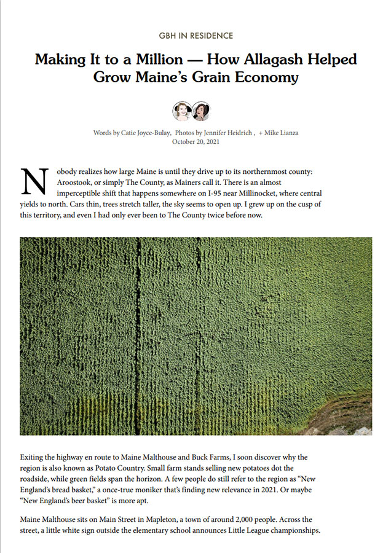

# Good PDF Hunting

This Chrome extension modifies the print styles for articles on Good Beer Hunting so they can be saved to PDF.

## Installation

1. Open Chrome
2. Go to Window -> Extensions
2. In the top right of the Extensions screen, toggle 'Developer Mode' on
3. In the bar developer bar, click 'Load unpacked'
4. Select the location of the cloned/downloaded files
5. Go back to the browser
5. Visit an article on GoodBeerHunting.com
6. File -> Print
7. Voila!

| Before  | With |
| ------------- | ------------- |
|  |   |